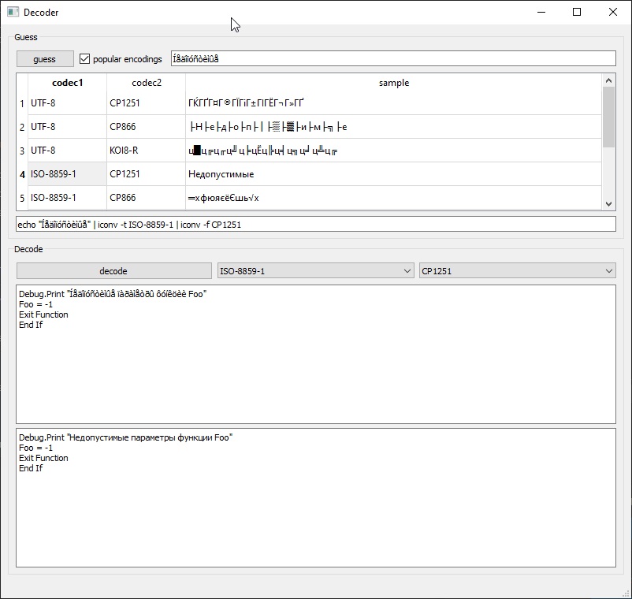

# decode-text

# Purpose

Sometimes some applications confuse encodings and produce broken text, for example when one expects local one-byte encoding but got unicode or vice versa. Sometimes original text can be decoded back to original state using two codecs.

# Usage

Paste sample of text into top input field and click "guess".

Double click table row with best guess.

Paste whole text to decode text input and click "decode".
